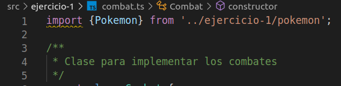

# Práctica 6: Clases e interfaces genéricas. Informe.
## Desarrollo de Sistemas Informáticos 
## Raúl Martín Rigor - alu0101203003@ull.edu.es

### Introducción

En este informe se resumen las actividades realizadas en la **práctica 6** para poner en práctica nuestros conocimientos de TypeScript sobre clases e interfaces genéricas a través de la implementación de distintas funciones en una serie de ejercicios. En esta práctica tambien haremos uso de los principios SOLID.

### Objetivos

Al finalizar la práctica, habremos completado los siguientes objetivos:

* Crear y manipular con soltura clases genéricas y plantillas
* Usar interfaces genéricas para su posterior implementación en clases
* Saber gestionar las responsabilidades de cada clase / interfaz
* No usar una misma clase para distintas funcionalidades
* Seguir los principios SOLID en el desarrollo de nuestros programas

### 1. Creación y configuración del driectorio del proyecto.

#### 1.1. Estructura inicial

Para la creación de la estructura inicial, seguiremos los mismos pasos que en practicas anteriores ([práctica 4](https://github.com/ULL-ESIT-INF-DSI-2021/ull-esit-inf-dsi-20-21-prct04-arrays-tuples-enums-alu0101203003/blob/gh-pages/index.md)).

La estructura debería quedar similar a las siguientes fotos:

  

#### 1.2. Organización de los ejercicios

Será necesario implementar las clases de cada ejercicio en ficheros diferentes. Los ficheros que dependan de otros requeriran de un `import` del fichero que necesiten:

 
