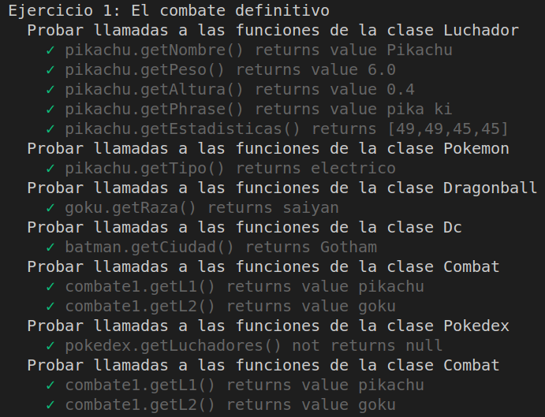
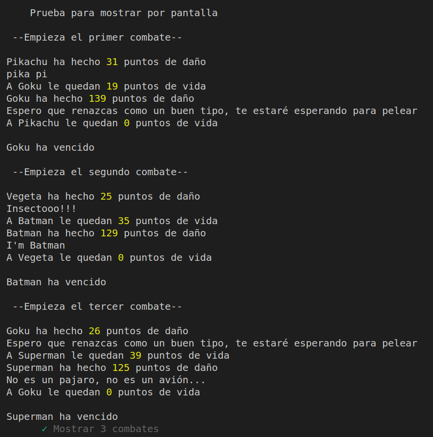
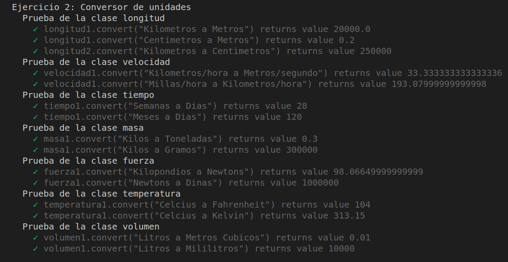
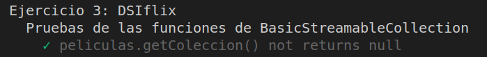
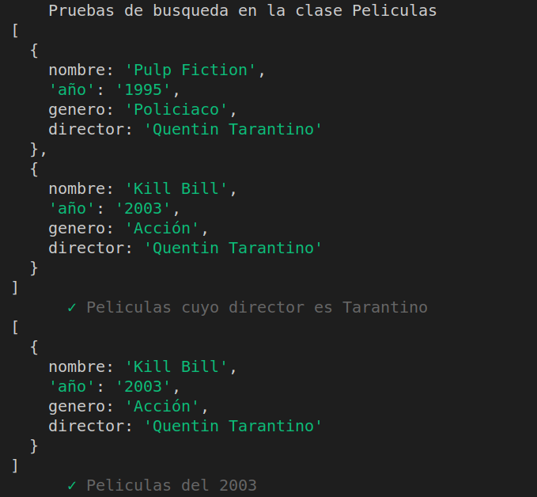
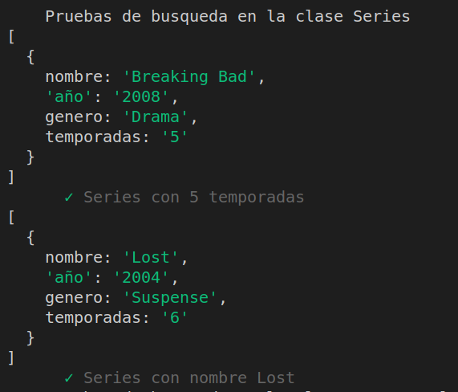
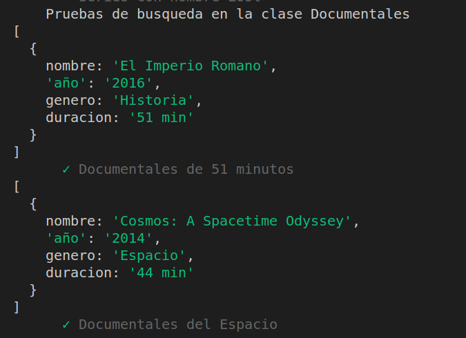

# Práctica 6: Clases e interfaces genéricas. Informe.
## Desarrollo de Sistemas Informáticos 
## Raúl Martín Rigor - alu0101203003@ull.edu.es

### Introducción

En este informe se resumen las actividades realizadas en la **práctica 6** para poner en práctica nuestros conocimientos de TypeScript sobre clases e interfaces genéricas a través de la implementación de distintas funciones en una serie de ejercicios. En esta práctica tambien haremos uso de los principios SOLID.

### Objetivos

Al finalizar la práctica, habremos completado los siguientes objetivos:

* Crear y manipular con soltura clases genéricas y plantillas
* Usar interfaces genéricas para su posterior implementación en clases
* Saber gestionar las responsabilidades de cada clase / interfaz
* No usar una misma clase para distintas funcionalidades
* Seguir los principios SOLID en el desarrollo de nuestros programas

### 1. Creación y configuración del driectorio del proyecto.

#### 1.1. Estructura inicial

Para la creación de la estructura inicial, seguiremos los mismos pasos que en practicas anteriores ([práctica 4](https://github.com/ULL-ESIT-INF-DSI-2021/ull-esit-inf-dsi-20-21-prct04-arrays-tuples-enums-alu0101203003/blob/gh-pages/index.md)).

La estructura debería quedar similar a las siguientes fotos:

  

#### 1.2. Organización de los ejercicios

Será necesario implementar las clases de cada ejercicio en ficheros diferentes. Los ficheros que dependan de otros requeriran de un `import` del fichero que necesiten:

 

### 2. Ejercicios

Paso a explicar la resolución de cada ejercicio y a adjuntar su código y expectativa. Se mostrará una versión simplificada de los enunciados de los ejercicios (para verlos al completo con aclaraciones y pistas, consultar la [guía de la práctica](https://ull-esit-inf-dsi-2021.github.io/prct06-generics-solid/).

(Para poder acceder a los atributos privados que creemos en las clases usaremos funciones *set* y *get*, las cuales se pueden encontrar en el código fuente.)

#### 2.1 Ejercicio 1

**Enunciado:**

Partiendo del desarrollo realizado para el Ejercicio 1 de la Práctica 5, supongamos que ahora queremos incluir distintos tipos de contendientes a la pelea. Por ejemplo, podríamos incluir personajes del universo Marvel, DC Comics, Star Wars o Dragon Ball entre otros. Puede incluir otros universos y/o personajes que desee. Para extender el desarrollo anterior se pide:

* Desarrolle una clase abstracta llamada Fighter que permita hacer que un contendiente pueda luchar. Esta clase se considerará la superclase del resto de clases a implementar. Para cada universo, desarrolle la clase que lo represente (Pokemon, Marvel, DC, Star Wars, Dragon Ball, etc).
* Cada contendiente debe ser descendiente de su clase universo. Además, para cada contendiente se debe poder acceder a la información requerida para la clase Pokemon de la práctica anterior (nombre, altura, peso, etc). Puede incluir información extra que considere oportuna según el universo.
* La clase Combat ahora permitará que los combates se disputen entre contendientes de distintos universos. Todas las combinaciones deben ser posibles, incluso contendientes del mismo universo. Asimismo, la simulación de los combates debe ser similar a la realizada en la práctica anterior. Sin embargo, ahora con cada ataque los contendientes deberán mostrar alguna catching phrase representativa de su personaje.
* Actualice los valores de efectividad de los movimientos de los nuevos contendientes de la forma que considere oportuna. Contendientes de un universo son más fuertes que los de otro, personajes concretos son más fuertes que otros sin importar el universo o una mezcla de ambas. Puede basarse en un criterio similar al empleado en las prácticas anteriores sobre los tipos de Pokemon.
* La clase Pokedex deberá actualizarse para incluir también el resto de contendientes. Esto es, deberá ser capaz de almacenar personajes de todos los universos considerados dentro de una misma estructura de datos. Además, deberá ofrecer todas las funcionalidades previamente requeridas para los nuevos contendientes.
* Por último, desarrolle este ejercicio empleando los principios SOLID Single Responsability y Open-Closed.

**Resolución:**

La estrategia a seguir para resolver este ejercicio pasa por usar la clase Fighter como una clase padre padre que tenga los atributos básicos de cualquier luchador. Todas las clases que se encuentrar por debajo en la jerarquía heredarán estos atributos y, además, tendrán otros atributos nuevos exclusivos de cada clase.

```ts
export abstract class Fighter {
    private EstadisticasBasicas = {
        ataque : 0,
        defensa : 0,
        velocidad :0,
        hp : 0,
    }

    /**
     * Constructor
     * @param nombre nombre del luchador
     * @param peso peso del luchador
     * @param altura altura del luchador
     * @param phrase catching phrase del luchador
     * @param estadisticas estadisticas asignables al atributo "EstadisticasBasicas" del luchador
     */
    constructor (private nombre :string, private peso :number, private altura :number, private phrase :string, estadisticas :number[]){
        this.EstadisticasBasicas.ataque = estadisticas[0];
        this.EstadisticasBasicas.defensa = estadisticas[1];
        this.EstadisticasBasicas.velocidad = estadisticas[2];
        this.EstadisticasBasicas.hp = estadisticas[3];
    }
    
    ...
```
Las clases hijas serán responsables del acceso a sus nuevos atributos exclusivos (por ejemplo el *tipo* en los pokemons):


```ts
/**
 * Clase Pokemon
 * Representa a los luchadores del universo Pokemon
 * Hereda de la clase Fighter
 */
export class Pokemon extends Fighter {
    /**
     * Constructor
     * @param nombre nombre del luchador (heredado de Fighter)
     * @param peso peso del luchador (heredado de Fighter)
     * @param altura altura del luchador (heredada de Fighter)
     * @param phrase catching phrase del luchador (heredada de Fighter)
     * @param estadisticas estadisticas asignables al atributo "EstadisticasBasicas" del luchador (heredadas de Fighter)
     * @param tipo tipo del pokemon (hierba, electrico...)
     */
    constructor (nombre :string, peso :number, altura :number, phrase :string, estadisticas :number[], private tipo :string){
        super(nombre,peso,altura,phrase,estadisticas)
    }

    /**
     * Funcion getTipo
     * @returns tipo
     */
     public getTipo(){
        return this.tipo
    }

    /**
     * Funcion setTipo
     * @param tipo tipo a asignar
     */
    public setTipo(tipo :string){
        this.tipo = tipo
    }
}
```

La nueva clase combat permitirá el enfrentamiento entre cualesquiera dos luchadores:

```ts
/**
 * Clase para implementar los combates
 */
export class Combat {
    /**
     * Constructor
     * @param luchador1 luchador que ataca primero
     * @param luchador2 luchador que ataca segundo
     */
    constructor (private luchador1 :Fighter, private luchador2 :Fighter){
    }
```

En esta clase, la funcion de daño se calculará ahora de distinta forma a la anterior práctica. Se debe poder calcular la efectividad de los ataques en función de parámetros comunes a cualquier luchador. 
Mi criterio se basa en usar el índice de masa corporal (IMC); de tal manera que, el luchador con mayor relación de peso y altura, tendrá ventaja en el combate.

```ts
    /**
     * Funcion luchadorDamage
     * La efectividad se calcula en funcion del indice de masa corporal (IMC)
     * @param atacante luchador que tiene el turno para atacar (1 o 2)
     * @returns daño realizado por el luchador que ataca
     */
    public luchadorDamage(atacante :number){
        var imc1 = this.luchador1.getAltura()/(Math.pow(this.luchador1.getPeso(),2));
        var imc2 = this.luchador2.getAltura()/(Math.pow(this.luchador2.getPeso(),2));
        var at1 = this.luchador1.getEstadisticas().ataque
        var df1 = this.luchador1.getEstadisticas().defensa
        var at2 = this.luchador2.getEstadisticas().ataque
        var df2 = this.luchador2.getEstadisticas().defensa

        var efectividad1 :number = 0.0;
        var efectividad2 :number = 0.0;
    
        switch (true) {
            case imc1 > imc2:
                efectividad1 = 2.0;
                efectividad2 = 0.5;
                break;
            case imc1 == imc2:
                efectividad1 = 1.0;
                efectividad2 = 1.0;
                break;
            case imc1 < imc2:
                efectividad1 = 0.5;
                efectividad2 = 2.0;
                break;
            default:
                break;
        }

        if (efectividad1 == 0 || efectividad2 == 0){
            return ("Error: Peso/Altura mal especificado/s")
        }

        var damage :number = 0
        if (atacante == 1){
        damage = 50 * (at1/df2) * efectividad1;
        }
        if (atacante == 2){
        damage = 50 * (at2/df1) * efectividad2;
        }
        return damage;
    }
```

La función start se encargará de mostrar la información que va ocurriendo en cada combate. Para esta práctica, esta información contiene también la frase representativa del personaje que ataca (cada vez que un luchador ataca a otro, se mostrará por pantalla su catching phrase -esto se verá con más claridad en las espectativas más adelante):

```ts
    /**
     * Funcion start
     * Inicia el combate e inidica las variaciones de las vidas de los luchadores enfrentados con cada ataque
     * @returns mensaje inidicando que luchador resulta vencedor
     */
    public start(){

        while (this.luchador1.getEstadisticas().hp > 0 && this.luchador2.getEstadisticas().hp > 0){
            var ataque1 :(number|string) = this.luchadorDamage(1)
            var ataque2 :(number|string) = this.luchadorDamage(2)
            if (typeof ataque1 === "number" && typeof ataque2 === "number"){
                ataque1 = Math.round(ataque1);
                ataque2 = Math.round(ataque2);

            var vidaNueva2 : number = this.luchador2.getEstadisticas().hp - ataque1;
            if (vidaNueva2 < 0){
                vidaNueva2 = 0;
            }
            this.luchador2.setHp(vidaNueva2)
            console.log(this.luchador1.getNombre(),"ha hecho",ataque1, "puntos de daño")
            console.log(this.luchador1.getPhrase())
            console.log("A",this.luchador2.getNombre(),"le quedan",this.luchador2.getEstadisticas().hp,"puntos de vida")
            if (this.luchador2.getEstadisticas().hp == 0){
                break;
            }

            var vidaNueva1 : number = this.luchador1.getEstadisticas().hp - ataque2;
            if (vidaNueva1 < 0){
                vidaNueva1 = 0;
            }
            this.luchador1.setHp(vidaNueva1)
            console.log(this.luchador2.getNombre(),"ha hecho",ataque2, "puntos de daño")
            console.log(this.luchador2.getPhrase())
            console.log("A",this.luchador1.getNombre(),"le quedan",this.luchador1.getEstadisticas().hp,"puntos de vida")
            if (this.luchador1.getEstadisticas().hp == 0){
                break;
            }

            } else {
                return "Error: Peso/Altura de algún luchador mal especificado"
            }
        }

        if (this.luchador1.getEstadisticas().hp <= 0){
            return ('\n' + this.luchador2.getNombre() + ' ha vencido')
        } else{
            return ('\n' + this.luchador1.getNombre() + ' ha vencido')
        }
    }
```
Por último, la clase Pokedex ahora podrá albergar luchadores de todos los tipos. Esto se traduce en una implementación de la clase de tal manera que, el atributo que representa el arreglo contenedor de los luchadores, sea ahora de una union de tipos entre todos los tipos de luchador posibles. De esta manera lograremos tener a todos los contendientes en una misma estructura de datos:

```ts
/**
 * Clase que almacena un conjunto de luchadores
 */
 export class Pokedex {
    /**
     * Constructor
     * @param luchadores conjunto de luchadores
     */
    constructor(private luchadores :(Pokemon | Dragonball | Dc)[]){}

    /**
     * Funcion getLuchadores
     * @returns luchadores a obtener
     */
    public getLuchadores(){
        return this.luchadores
    }

    /**
     * Funcion setLuchadores
     * @param luchadores conjunto de luchadores a asignar
     */
    public setLuchadores(luchadores :(Pokemon | Dragonball | Dc) []){
        this.luchadores = luchadores
    }

    /**
     * Funcion addLuchador
     * @param luchador luchador a añadir al conjunto
     */
    public addLuchador(luchador :(Pokemon | Dragonball | Dc)){
        this.luchadores.push(luchador)
    }
}
```




#### 2.2 Ejercicio 2

**Enunciado:**
Considere una herramienta que nos permita realizar las conversiones de unidades o sistemas de medición para distintas magnitudes físicas. Las más comunes pueden ser:

* Velocidad
* Masa
* Longitud
* Tiempo
* Temperatura
* Fuerza
* Volumen

Diseñe una interfaz genérica isConvertible que permita realizar conversiones entre sistemas para cada magnitud considerada. La interfaz debe definirse de modo que, aquellas clases que la implementen, ofrezcan la posibilidad de hacer cambios entre, al menos, dos sistemas o unidades diferentes como, por ejemplo, en el caso de la velocidad, de millas por horas a kilómetros por hora. A continuación, diseñe diferentes clases, una por magnitud física, que implementen dicha interfaz. El desarrollo propuesto deberá incluir las siguientes funcionalidades:

* Una clase para cada magnitud considerada.
* Se pide ser capaz de poder cambiar, al menos, entre dos unidades o sistemas de medición por cada magnitud.
* El software deberá seguir los principios SOLID Single Responsability and Open-Closed.


**Resolución:**

Partiremos de la interfaz genérica isConvertible, la cual determinará que la clase que la implemente tenga un atributo *unidad* (que representa el numero a convertir de una unidad a otra o la cantidad de unidades) y un atributo *cambios* (que albergará todos los cambios entre unidades disponibles para cada magnitud). Además, todas estas clases deberán implementar también la función *convert*, encargada de convertir las unidades en función del cambio especificado:

```ts
/**
 * Interfaz isConvertible para magnitudes
 */

 export interface isConvertible<T> {
    unidad :number;
    cambios :T

    /**
     * Funcion convert. 
     * Convierte la unidad del objeto al que se aplica 
     * en función de la conversion recibida como parámetro
     * @param conversion
     */
    convert(conversion :string): number;
}
```

Cada clase hija representará una magnitud. Estas Implementarán la interfaz isConvertible de tal manera que, en cada caso, permita cambiar entre ciertas unidades especificadas. Cada magnitud tendrá su propio array con los cambios disponibles que será usado en la función convert para comparar con el parámetro recibido y realizar la operación pertinente para llevar a cabo la conversión en cada caso (la función devolverá la unidad convertida satisfactoriamente). A continuación un ejemplo con Longitud:

```ts
/**
 * Array que contiene los posibles cambios 
 * (La conversion deberá coincidir con alguno de ellos)
*/
var cambiosLongitud :string[] = ["Metros a Kilometros","Kilometros a Metros",
                                "Metros a Centimetros","Centimetros a Metros",
                                "Kilometros a Centimetros","Centimetros a Kilometros"]
/**
 * Clase Longitud.
 * Posibilita los cambios de unidades de Longitud.
 * Implementa la interfaz isConvertible
 */
export class Longitud implements isConvertible<string[]> {
    cambios = cambiosLongitud;
    /**
     * Constructor
     * @param unidad unidad de medida que va a ser convertida
     */
    constructor(public unidad :number){}

    /**
     * Funcion convert. 
     * Convierte la unidad del objeto al que se aplica 
     * en función de la conversion recibida como parámetro
     * @param conversion
     */
    convert(conversion :string){
        var resultado :number = 0;
        switch (conversion) {
            case this.cambios[0]:
                resultado = this.unidad/1000
                break;
            case this.cambios[1]:
                resultado = this.unidad*1000
                break;
            case this.cambios[2]:
                resultado = this.unidad*100
                break;
            case this.cambios[3]:
                resultado = this.unidad/100
                break;
            case this.cambios[4]:
                resultado = this.unidad*100000
                break;
            case this.cambios[5]:
                resultado = this.unidad/100000
                break;
            default:
                break;
        }
        return resultado
    }
```


#### 2.3 Ejercicio 3

**Enunciado:**

Imagine que tiene que diseñar el modelo de datos de una plataforma de vídeo en streaming. A través del catálogo de dicha plataforma se puede acceder a películas, series y documentales:

* Defina una interfaz genérica Streamable que trate de especificar propiedades y métodos con los que debería contar una colección de emisiones concreta como, por ejemplo, una colección de series. Por ejemplo, deberían definirse métodos de búsqueda en dicha interfaz, que permitan obtener listados en función de diferentes términos de búsqueda: por año o por nombre, entre otros.
* Defina una clase abstracta genérica BasicStreamableCollection que implemente dicha interfaz genérica. En este punto, podrá particularizar algunas de las propiedades y métodos de la interfaz Streamable, aunque otros tendrán que permanecer como abstractos para ser definidos más abajo en la jerarquía de clases. Todo dependerá del diseño que haya llevado a cabo.
* Tendrá que extender dicha clase abstracta para obtener subclases que modelen cada uno de los tres tipos de colecciones: series, películas y documentales.
* Trate de aplicar los principios SOLID. Preste especial atención al diseño de la interfaz Streamable. Si cree que debe dividirla en interfaces genéricas más pequeñas porque su diseño inicial es muy complejo, hágalo, con el objetivo de cumplir con el cuarto principio SOLID Interface segregation.

**Resolución:**

Para resolver este problema crearemos la interfaz genérica Streamable que contiene un atributo colección para almacenar elementos y dos funciones que permiten mostrar y ampliar la colección: 

```ts
/**
 * Interfaz Streameable para una colección de emisiones
 */
 export interface Streamable<T> {
    coleccion: T[]

    /**
     * Funcion add.
     * Añade una emision nueva a la coleccion
     * @param emision emision a añadir
     */
    add(emision :T): void;

    /**
     * Funcion getColeccion. 
     * Devuelve la coleccion de emisiones
     */
    getColeccion(): T[];
}
```

En el futuro requeriremos de una función que nos permita buscar dentro de la colección en función de ciertos parámetros pero, si usáramos la misma interfaz para este propósito, acabaría resultando muy compleja. Por ello, seguiremos el principio de Interface segregation y crearemos otra interfaz Searchable que contenga una función que nos permita buscar:

```ts
/**
 * Interfaz Searchable para la funcion de busqueda.
 * (Segregacion de Interfaces)
 */
 export interface Searchable<T> {
    /**
     * Funcion Search.
     * Busca, dentro de la coleccion, los elementos que tienen el atributo especificado
     * @param atributo atributo a encontrar
     * @param tipo tipo del atributo
     */
    search(atributo :string, tipo :string): T[]
}
```
Crearemos una clase abstracta BasicStreamableCollection que implementará estas dos interfaces, dando como resultado una clase genérica capaz de ser usada para cada tipo de colección de emisiones. Esta clase implementará las funciones que tienen que ver con mostrar y añadir elementos a la colección ya que serán comunes para todas las colecciones. Sin embargo, el método search permanecerá abstracto a la espera de ser implementado de manera única en cada colección (ya que la búsqueda será distinta para cada una de ellas):

```ts
export abstract class BasicStreamableCollection<T> implements Streamable<T>,Searchable<T>{
    constructor(public coleccion: T[]){}

    /**
     * Funcion add.
     * Añade una emision nueva a la coleccion
     * @param emision emision a añadir
     */
    add(emision :T){
        this.coleccion.push(emision)
    }

    /**
     * Funcion getColeccion. 
     * Devuelve la coleccion de emisiones
     */
    getColeccion(){
        return this.coleccion
    }

    /**
     * Funcion Search.
     * Busca, dentro de la coleccion, los elementos que tienen el atributo especificado
     * @param atributo atributo a encontrar
     * @param tipo tipo del atributo
     */
    abstract search(atributo :string, tipo :string): T[]
}
```

Para cada tipo de colección se creará un tipo personalizado de emisiones que alberga en su colección, el cual contiene todos los atributos necesarios para definir cada emision:

```ts
/**
 * Tipo Pelicula.
 * Especifica los atributos que debe tener toda pelicula
 */
export type Pelicula = {
    nombre:string,
    año :string,
    genero :string,
    director :string
}
```
La clase de cada colección heredará el atributo colección de la clase BasicStreamableCollection y lo usará a su manera con el tipo de dato que corresponda (por ejemplo: en el caso de colecciones de películas, se usará el tipo *Pelicula*):

```ts
/**
 * Clase Peliculas.
 * Almacena la coleccion de las peliculas y permite buscar dentro de esta coleccion
 * Hereda de la clase BasicStreamableCollection
 */
export class Peliculas extends BasicStreamableCollection<Pelicula>{
    /**
     * Constructor
     * @param coleccion coleccion de peliculas (usa la plantilla de BasicStreamableCollection)
     */
    constructor(coleccion :Pelicula[]){
        super(coleccion)
    }
```

Estas clases tendrán la responsabilidad de implementar el método search de manera que se pueda recorrer la colección por el tipo de atributo deseado (*tipo*) buscando el atributo concreto especificado en la función (*atributo*):

```ts
search(atributo :string, tipo :string){
        var resultado :Pelicula[] = []
        
        switch (tipo){
            case "nombre":
                this.coleccion.forEach(element => {
                    if (element.nombre == atributo) {
                        resultado.push(element)
                    }
                });
                break;
            case "año":
                this.coleccion.forEach(element => {
                    if (element.año == atributo) {
                        resultado.push(element)
                    }
                });
                break;
            case "genero":
                this.coleccion.forEach(element => {
                    if (element.genero == atributo) {
                        resultado.push(element)
                    }
                });
                break;
            case "director":
                this.coleccion.forEach(element => {
                    if (element.director == atributo) {
                        resultado.push(element)
                    }
                });
                break;
            default:
                break;
        }
        return resultado
     }
```

Cada clase usará un tipo de dato y estos tendrán atributos distintos, por lo tanto, la función search será distinta para cada clase.






### Conclusiones

Esta práctica me resultó de gran utilidad para poner en práctica los conocimientos sobre objetos, clases e interfaces. He aprendido bastante sobre este tipo de datos y, sin duda, serán herramientas que usaré a menudo en mis siguientes proyectos de TypeScript.

### Bibliografía

A continuación se muestra una serie de recursos que han sido de gran utilidad para la realización de la práctica y de este informe:

Recurso| Dirección
-------|----------
Guía de la práctica | https://ull-esit-inf-dsi-2021.github.io/prct05-objects-classes-interfaces/
Apuntes | https://ull-esit-inf-dsi-2021.github.io/typescript-theory/typescript-arrays-tuples-enums.html
W3schools | https://www.w3schools.com/
Instancias y constructores | https://stackoverflow.com/questions/6973866/javascript-get-type-instance-name/36094818
